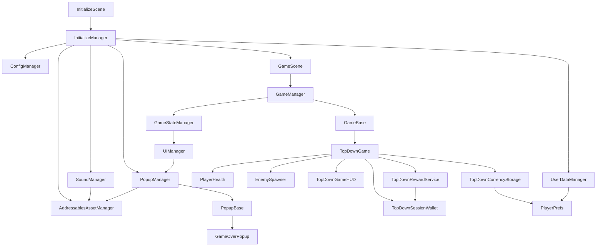

# Unity PC Portfolio Framework

캐주얼 및 하이퍼 캐주얼 게임 개발을 위한 Unity 기반의 확장 가능한 2D Top-Down 액션 프레임워크입니다.  
단순한 단일 게임 구현을 넘어, 다양한 프로젝트에 즉시 재사용할 수 있도록 **앱 실행 흐름, 상태 관리(FSM), 동적 리소스 로딩(Addressables), 그리고 도메인별 책임이 분리된 모듈화 아키텍처**를 구축하는 것을 목표로 설계되었습니다.

---

## 📸 Screenshots / GIF


---

## 🛠 Tech Stack

단순한 기능 구현을 넘어, 프로젝트의 유지보수성과 확장성을 고려하여 아래의 기술들을 채택했습니다.

* **Unity 6 & C#** - 최신 엔진 기능 활용 및 객체 지향적(OOP) 구조 설계
* **Unity Addressables** - 메모리 최적화 및 에셋의 동적 로딩/캐싱 관리
* **Unity Input System** - PC(키보드) 및 모바일(가상 조이스틱) 입력의 유연한 확장 처리
* **TextMeshPro & Unity UI** - 해상도 대응 및 상태 기반의 UI Root 전환 제어
* **Object Pooling** - 런타임 중 빈번하게 생성/파괴되는 적 개체 및 사운드 소스의 가비지 컬렉션(GC) 스파이크 방지
* **PlayerPrefs** - 누적 재화 및 설정 데이터의 로컬 영구 저장

---

## 📐 Architecture Overview

전체 시스템은 모듈 간의 결합도를 낮추고 독립성을 보장하기 위해 단방향 흐름과 이벤트 구독 방식으로 설계되었습니다.



### Scene Structure
* **InitializeScene (Bootstrap):** 실제 게임 로직에 진입하기 전, 매니저 클래스들을 초기화하고 필수 리소스를 캐싱하는 진입점 역할을 수행합니다.
* **GameScene:** 실제 게임 로직(`TopDownGame`)과 UI가 동작하며, 독립된 매니저들에 의해 상태가 제어되는 메인 씬입니다.

---

## 💡 Core Design Decisions

유지보수가 용이한 독립 컴포넌트 구조(MSA 형태)를 지향하며 아래와 같은 설계적 결정을 내렸습니다.

* **초기화(Bootstrap)와 게임 씬의 완전한 분리**
  * **이유:** 게임 씬에 매니저 초기화 로직이 혼재되어 있으면 씬 재시작이나 씬 이동 시 매니저의 생명주기가 꼬이는 문제가 발생합니다. `InitializeScene`을 도입하여 전역 매니저의 준비 상태를 완벽히 보장한 후 `GameScene`을 비동기로 로드하도록 설계했습니다.
* **단일 책임 원칙(SRP)에 기반한 상태와 로직의 분리 (`GameManager` vs `GameBase`)**
  * **이유:** 하나의 `GameManager`가 모든 인게임 로직을 통제하면 코드가 비대해집니다. 이를 해결하기 위해 전체 상태(Home, Playing 등) 제어는 `GameStateManager`에 위임하고, 실제 인게임 플레이 로직은 추상화된 `GameBase`를 상속받은 하위 클래스(예: `TopDownGame`)에서 처리하도록 분리했습니다. 이를 통해 추후 전혀 다른 장르의 미니게임을 프레임워크에 얹더라도 코어 매니저의 수정 없이 확장이 가능합니다.
* **세션 지갑(Wallet)과 누적 저장소(Storage)의 역할 분리**
  * **이유:** 인게임 플레이 중 발생하는 잦은 재화 획득을 매번 로컬 스토리지에 기록하면 I/O 병목이 발생합니다. 따라서 인게임에서는 메모리 기반의 `TopDownSessionWallet`에서만 상태를 관리하고, 게임 오버 시 `RewardService`를 통해 검증을 거친 후 `TopDownCurrencyStorage`에 일괄 반영하여 안정성을 높였습니다.
* **팝업 UI의 추상화 (`PopupBase` & `PopupManager`)**
  * **이유:** 팝업마다 중복되는 애니메이션, 백그라운드 Dim 처리, 닫기 버튼 로직을 제거하기 위해 `PopupBase`로 공통 기능을 추상화했습니다. 또한, Addressables와 연동하여 필요할 때만 메모리에 로드되도록 구현했습니다.

---

## ⚙️ Core Systems Detail

* **Bootstrap & Game Flow:** `InitializeManager`가 앱 실행을 준비하고, `GameManager`와 `GameStateManager`가 Home, Playing, Paused, GameOver 상태 간의 안전한 전환을 통제합니다.
* **UI & Popup System:** `UIManager`는 게임 상태 변경 이벤트를 구독하여 화면을 전환하며, `PopupManager`는 Addressables 기반의 팝업 캔버스 계층(Priority)을 동적으로 관리합니다.
* **Resource & Sound Management:** `AddressablesAssetManager`를 통한 비동기 로딩 및 LRU(Least Recently Used) 기반 캐시 정리를 지원하며, `SoundManager`는 AudioSource 풀링을 통해 다중 SFX 재생 성능을 최적화했습니다.
* **Gameplay & Reward:** 오브젝트 풀링 기반의 적 스폰과 시간 비례 난이도 증가 시스템을 갖춘 2D 탑다운 액션이 기본 제공되며, 독립된 재화 컴포넌트(`SessionWallet`, `CurrencyStorage`)가 보상 흐름을 제어합니다.

---

## 📁 Folder Structure

```txt
Assets/
└── _Scripts/
    ├── Core/                   # 프레임워크 기반 공통 모듈 및 시스템 기저
    │   ├── Audio/              # 사운드 관리 및 시스템 (SoundManager 등)
    │   ├── Common/             # 공통 유틸리티 및 정의
    │   ├── Data/               # 영구 데이터 및 유저 정보 관리 (UserDataManager 등)
    │   ├── Resource/           # Addressables 기반 리소스 로딩 (AddressablesAssetManager 등)
    │   └── UI/                 # UI 및 팝업 시스템 베이스 계층 (PopupBase, PopupManager 등)
    │
    ├── GameFlow/               # 게임 흐름 제어 및 FSM 시스템
    │   ├── Base/               # 게임 루프 추상 클래스 (GameBase 등)
    │   ├── Managers/           # 코어 흐름 중계 매니저 (GameManager 등)
    │   └── State/              # 글로벌 게임 상태 관리 (GameStateManager 등)
    │
    ├── GamePlay/               # 실제 인게임 콘텐츠 도메인
    │   ├── Camera/             # 카메라 연출 및 제어
    │   ├── Core/               # 인게임 코어 플레이 로직 (TopDownGame 등)
    │   ├── Currency/           # 세션/누적 재화 처리 및 보상 (SessionWallet, RewardService 등)
    │   ├── Enemy/              # 적 생성 및 풀링 시스템 (EnemySpawner, EnemyController 등)
    │   ├── Joystick/           # 입력 UI 컴포넌트 (VirtualJoystick 등)
    │   ├── Player/             # 플레이어 캐릭터 및 전투 스크립트
    │   ├── Timer/              # 생존 시간 및 인게임 타이머 관리
    │   └── UI/                 # 인게임 전용 HUD 및 UI 패널 전환 (UIManager 등)
    │
    └── SceneManagement/        # 씬 전환 및 진입점 제어
        └── InitializeManager.cs # 프레임워크 Bootstrap 엔트리 스크립트
```

---
## 💻 How to Run

1. Unity 6 버전으로 프로젝트를 엽니다.
2. **Addressables Groups** 설정을 열어 에셋 빌드 상태를 최신화합니다.
3. **Build Settings**에 `Scenes` 폴더 내의 `InitializeScene`과 `GameScene`을 순서대로 등록합니다.
4. `Scenes/InitializeScene`을 연 뒤 에디터에서 실행(Play)합니다.
5. Bootstrap 초기화가 완료되면 자동으로 `GameScene`으로 진입하여 테스트를 진행할 수 있습니다.

---

**Author** Unity Wizard
